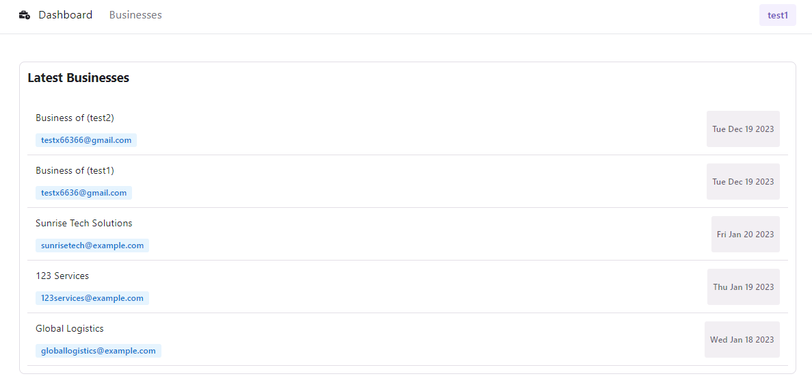
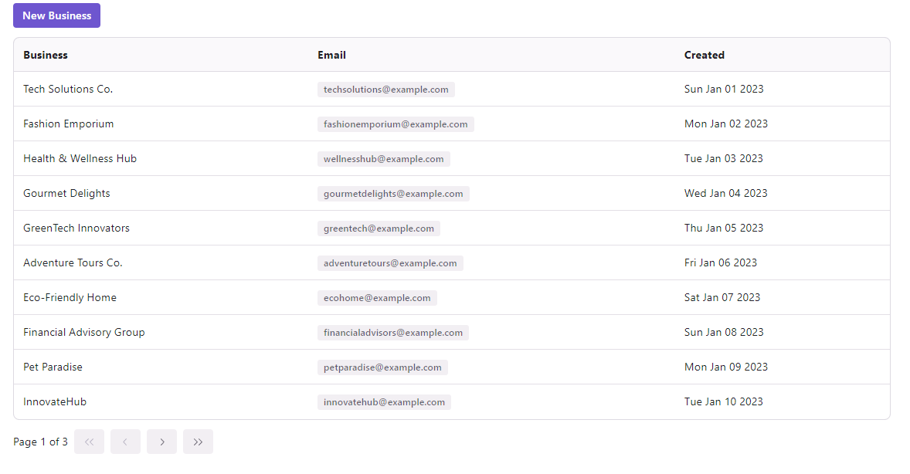
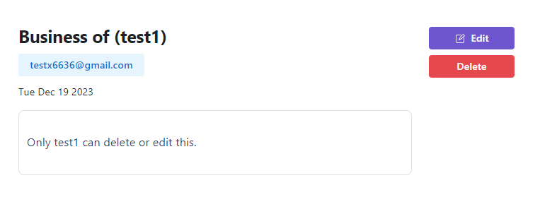
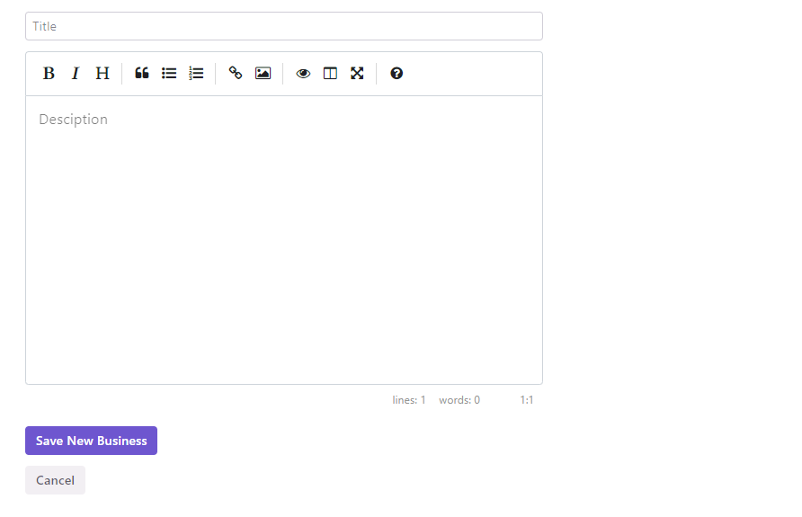
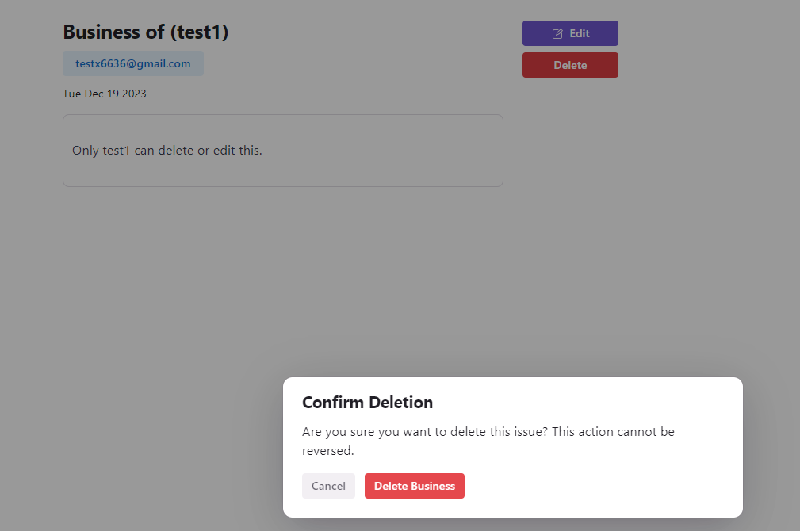
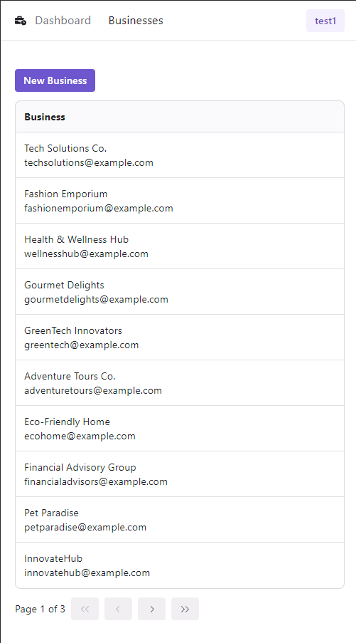

# Business Manager

[Live Demo](https://business-manager-two.vercel.app/)

## Table of content:

- [Project Description](#project-description)
- [Stack and Frameworks](#tech-stack)
- [Features](#features)
- [Dependencies](#dependencies)
- [Setup](#setup)
- [Screenshots](#screenshots)

## Project Description:

### Overview:

This project is an a business listing management platform where users and add and manage their business.

## Tech Stack:

- Next.js
- Typescript
- React
- jQuery
- Node.js
- Tailwind CSS
- Radix UI
- Git
- VSCode
- Axios API
- Prisma
- Auth.js
- Zod
- Supabase DB
- DataGrip
- Postman

## Features:

- Sorting
- Authentication
- Authorization
- Mobile responsiveness
- Google Authentication
- REST API
- Zod Validation

## Code Style:

- Prettier
- Pascal Case

## Setup:

1. Clone this repository to your local machine.
2. Run `npm install` to install the required dependencies.
3. Rename .env.example to .env
4. Get Google API key at https://console.cloud.google.com/. You'll have to create an account first.
5. Get Auth.js key at https://next-auth.js.org/configuration/options. You'll have to create an account first.
6. Add the API keys to **.env**
7. Run `npm run dev` to start the web server.

## Screenshots:

### Homepage

### Business List

### Business Page

### Create Business

### Delete Business

### Mobile View

